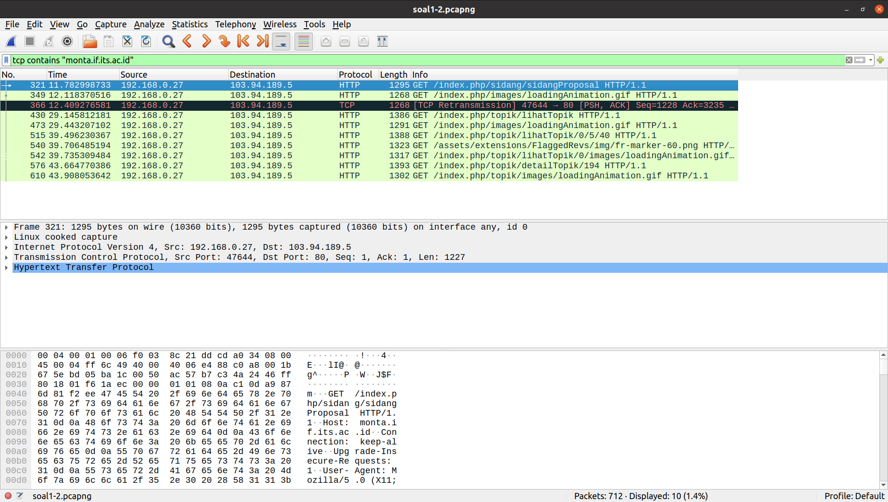

# Jarkom Modul 1 F02 2022

### Anggota:

1. [Andymas Narendra Bagaskara](https://github.com/zaibir123) (05111940000192)
2. [Jayanti Totti Andhina](https://github.com/JayantiTA) (5025201037)
3. [Gaudhiwaa Hendrasto](https://github.com/gaudhiwaa) (5025201066)

### 1. Sebutkan web server yang digunakan pada "monta.if.its.ac.id"!

Masukkan display filter `tcp contains "monta.if.its.ac.id"`

Kemudian klik kanan pada paket HTTP, pilih follow -> HTTP stream. Sehingga didapatkan jenis web server yang digunakan, yaitu **nginx/1.10.3**.

### 2. Ishaq sedang bingung mencari topik ta untuk semester ini , lalu ia datang ke website monta dan menemukan detail topik pada website “monta.if.its.ac.id” , judul TA apa yang dibuka oleh ishaq?

Langkah yang sama dengan nomor 1, kemudian ditemukan link Tugas Akhir yang sedang dibuka.

Dan ketika dibuka link tersebut, maka akan didapatkan judul Tugas Akhir: **Perancangan Sistem Pengendali Panas Otomatis pada Mesin Sangrai Kopi dengan Logika Fuzzy**.

### 3. Filter sehingga wireshark hanya menampilkan paket yang menuju port 80!

Masukkan display filter `tcp.dstport == 80 || udp.dstport == 80`, kemudian didapatkan semua paket yang menuju port 80.

### 4. Filter sehingga wireshark hanya mengambil paket yang berasal dari port 21!

Masukkan display filter `tcp.srcport == 21 || udp.srcport == 21`, kemudian didapatkan semua paket yang berasal dari port 21.

### 5. Filter sehingga wireshark hanya mengambil paket yang berasal dari port 443!

Masukkan display filter `tcp.srcport == 443 || udp.srcport == 443`, kemudian didapatkan semua paket yang berasal dari port 443.

### 7. Filter sehingga wireshark hanya mengambil paket yang berasal dari ip kalian!

Masukkan `ipconfig getifaddr end` di terminal untuk memeriksa alamat ip.

Masukkan display filter `ip.src==10.8.108.209`, kemudian didapatkan semua paket yang berasal dari ip 10.8.108.209.

### 9. Terdapat laporan adanya pertukaran file yang dilakukan oleh kedua mahasiswa dalam percakapan yang diperoleh, carilah file yang dimaksud! Untuk memudahkan laporan kepada atasan, beri nama file yang ditemukan dengan format [nama_kelompok].des3 dan simpan output file dengan nama “flag.txt”.

Masukkan display filter `tcp.stream eq 29`, kemudian didapatkan semua paket yang berasal dari ip tcp stream 29. Berikut isi file salt (save as raw):

